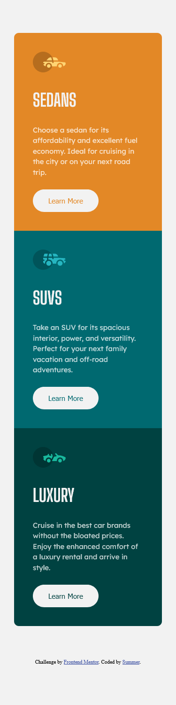
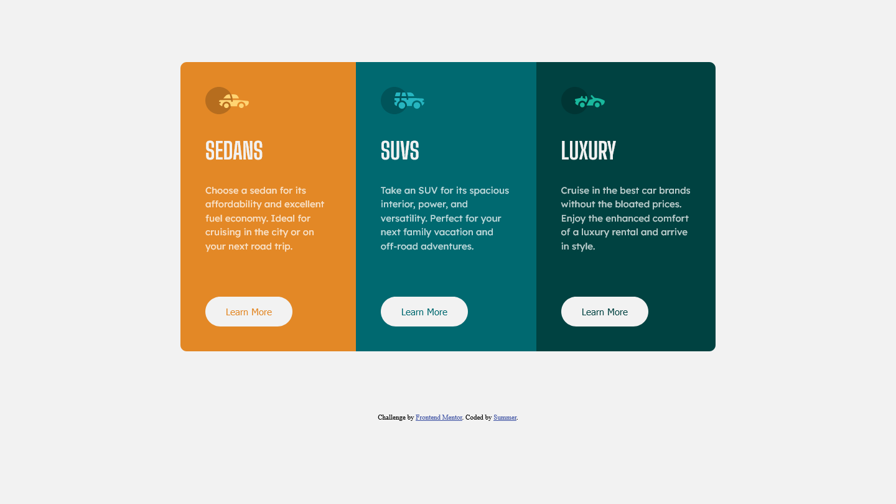

# 3-column preview card component

This is a solution to the [3-column preview card component challenge on Frontend Mentor](https://www.frontendmentor.io/challenges/3column-preview-card-component-pH92eAR2-). 

## Table of contents

- [3-column preview card component](#3-column-preview-card-component)
  - [Table of contents](#table-of-contents)
  - [Overview](#overview)
    - [The challenge](#the-challenge)
    - [Links](#links)
    - [Screenshot](#screenshot)
    - [Built with](#built-with)

## Overview

### The challenge

Users should be able to:

- View the optimal layout depending on their device's screen size
- See hover states for interactive elements

### Links

- Solution URL: [GitHub](https://github.com/summermmg/3-column-preview-card-component)
- Live Site URL: [Demo](https://summermmg.github.io/3-column-preview-card-component/)

### Screenshot

### Built with

- Semantic HTML5 markup
- CSS custom properties
- Flexbox
- Mobile-first workflow